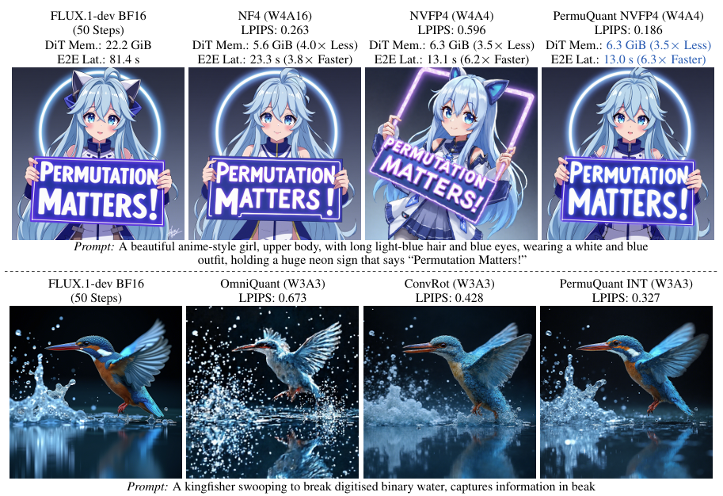
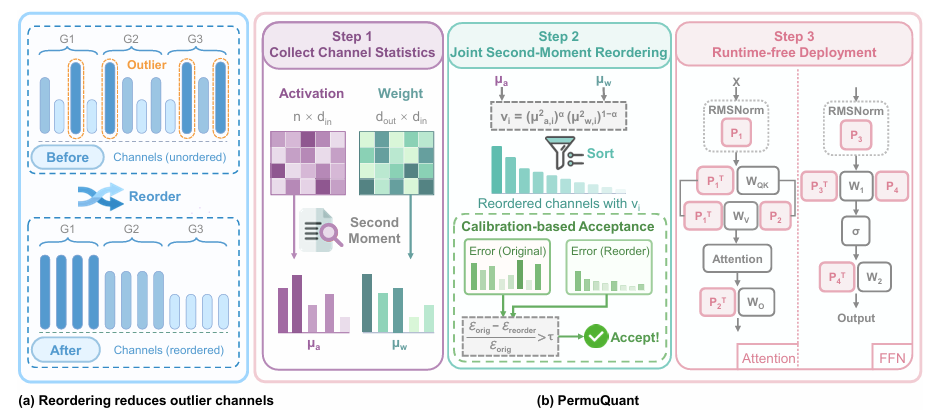
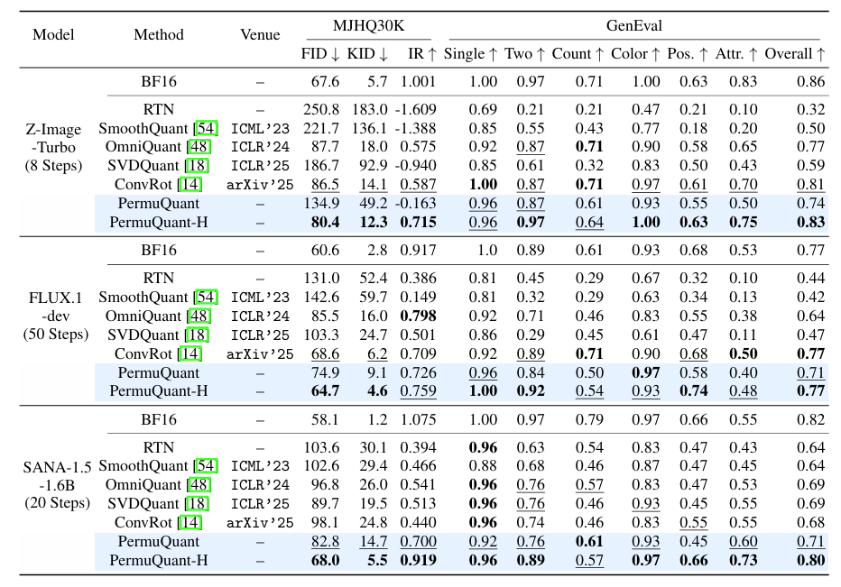
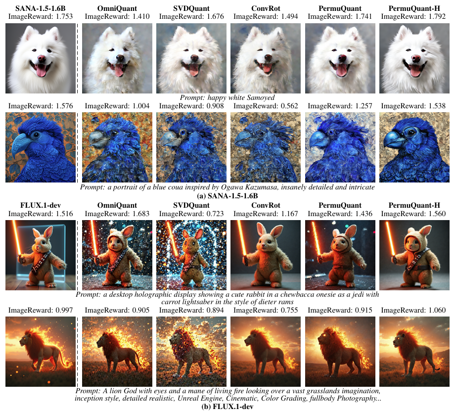

# PermuQuant: Lowering Per-Group Quantization Error by Reordering Channels for Diffusion Models
Yongsen Cheng, [Kai Liu](https://kai-liu.cn/), Kaiwen Tao, Junxian Li, Zhixin Wang, Zhikai Chen, Renjing Pei, [Yulun Zhang](http://yulunzhang.com/)

#### 🔥🔥🔥 News

- **2026-05-09:** This repo is released.

---

> **Abstract:** Large-scale visual generative models have achieved remarkable performance. However, their high computational and memory costs make deployment challenging in resource-constrained scenarios, such as interactive applications and personal single-GPU usage. Post-training quantization (PTQ) offers a practical solution by compressing pretrained models without expensive retraining. However, existing PTQ methods still suffer from severe quality degradation under extremely low-bit settings. In this paper, we identify channel ordering as an important but underexplored factor in per-group quantization. In this setting, each contiguous group shares one quantization scale. When channels with very different statistics are placed in the same group, the scale can be dominated by outliers and cause large quantization errors. Based on this observation, we propose PermuQuant, a simple and effective PTQ framework for low-bit diffusion models. PermuQuant sorts channels by a joint second-moment criterion before per-group quantization, placing channels with similar activation and weight statistics into the same group. It further uses a calibration-based acceptance rule to apply reordering only when the selected permutation reduces quantization error on calibration data. The selected permutations are absorbed into adjacent modules or applied to weights offline, avoiding explicit runtime permutation operations. Extensive experiments on multiple large diffusion models show that PermuQuant consistently reduces quantization error and outperforms existing PTQ baselines. On FLUX.1-dev with an NVIDIA RTX 5090, PermuQuant achieves up to a 1.8$\times$ single step speedup and reduces the DiT memory footprint by 3.5$\times$ under W4A4 NVFP4 quantization.

## ⚒️ TODO

* [ ] Release code

## 🔎 Method Overview

## 🔎 Results

Quantitative Results

  

Qualitative Results on W3A3

  

